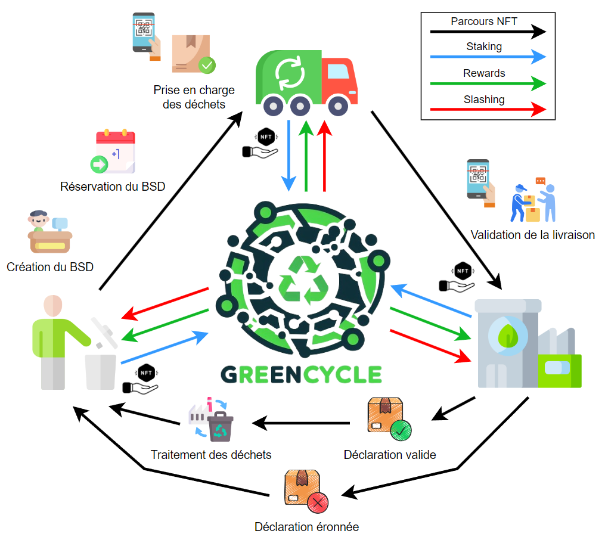

# GreenCycle - Recycle to earn♻️

This project aims to enhance waste traceability through blockchain technology while incorporating current environmental regulations. Our solution strives to engage all waste stakeholders, from producers to final treatment centers, in fulfilling their regulatory obligations, which will be programmed through smart contracts. Additionally, we are developing a reward system to incentivize and recognize their contributions to the environment, a major concern of our century.

### Context

This project was made during [Finney](https://en.wikipedia.org/wiki/Hal_Finney_(computer_scientist)) promotion from [Alyra](https://www.alyra.fr/) school and is only available on Mumbai testnet.

### Dapp 💻
- [GreenCycle](https://greencycle.localblock.dev)
- [Video presentation](https://greencycle.localblock.dev/video)

### Smart contracts 📄
- [AddressesProvider](https://mumbai.polygonscan.com/address/0x7773BfC0B9dee7c824f35f0C1E381b5137929696)
- [BSD NFT](https://mumbai.polygonscan.com/address/0x62f59530D60aCF3B803f7F10d5912c0256a4593A)
- [GRC Token](https://mumbai.polygonscan.com/address/0xf8787F9b5D0eAfB61A8aCc832Fc4B4f04F014431)
- [GRC Vault](https://mumbai.polygonscan.com/address/0x4cEe1614836cA5B4de553Fe5F2fAb5815daD2A55)

## Application stack 🔧

[![Polygon-badge]][Polygon-url]
[![Next-badge]][Next-url]
[![Typescript-badge]][Typescript-url]
[![Hardhat-badge]][Hardhat-url]
[![Alchemy-badge]][Alchemy-url]
[![Wagmi-badge]][Wagmi-url]
[![Chakra-badge]][Chakra-url]

## Features

- 🔒 Lock your GRC token to participate 
- 🏢 With a producer role you can track your wastes 
- 🚚 With a transporter role you can choose your waste 
- 🏭 With a recipient you can view all your shipped wastes 
- 🪙 Good job mean rewards 
- 🪚 Bad job mean slashing 

<!-- Links -->
[Wagmi-badge]:https://img.shields.io/badge/Wagmi-141414?style=for-the-badge&logoColor=white&logo=data:image/svg+xml;base64,PHN2ZyB3aWR0aD0iNjI5IiBoZWlnaHQ9IjYyOSIgdmlld0JveD0iMCAwIDYyOSA2MjkiIGZpbGw9Im5vbmUiIHhtbG5zPSJodHRwOi8vd3d3LnczLm9yZy8yMDAwL3N2ZyI+CjxnIGNsaXAtcGF0aD0idXJsKCNjbGlwMF8xMzFfMTQyKSI+CjxwYXRoIGZpbGwtcnVsZT0iZXZlbm9kZCIgY2xpcC1ydWxlPSJldmVub2RkIiBkPSJNNzEuNzg4IDM2Ni40N0M3MS43ODggMzg2LjI5NCA4Ny44NTgzIDQwMi4zNjQgMTA3LjY4MiA0MDIuMzY0SDE3OS40N0MxOTkuMjk0IDQwMi4zNjQgMjE1LjM2NCAzODYuMjk0IDIxNS4zNjQgMzY2LjQ3TDIxNS4zNjQgMjIyLjg5NEMyMTUuMzY0IDIwMy4wNyAyMzEuNDM0IDE4NyAyNTEuMjU4IDE4N0MyNzEuMDgyIDE4NyAyODcuMTUyIDIwMy4wNyAyODcuMTUyIDIyMi44OTRWMzY2LjQ3QzI4Ny4xNTIgMzg2LjI5NCAzMDMuMjIyIDQwMi4zNjQgMzIzLjA0NiA0MDIuMzY0SDM5NC44MzRDNDE0LjY1OCA0MDIuMzY0IDQzMC43MjggMzg2LjI5NCA0MzAuNzI4IDM2Ni40N1YyMjIuODk0QzQzMC43MjggMjAzLjA3IDQ0Ni43OTggMTg3IDQ2Ni42MjIgMTg3QzQ4Ni40NDYgMTg3IDUwMi41MTYgMjAzLjA3IDUwMi41MTYgMjIyLjg5NFY0MzguMjU4QzUwMi41MTYgNDU4LjA4MiA0ODYuNDQ2IDQ3NC4xNTIgNDY2LjYyMiA0NzQuMTUySDM1Ljg5NEMxNi4wNzAzIDQ3NC4xNTIgMCA0NTguMDgyIDAgNDM4LjI1OEwxLjI2NzgyZS0wNSAyMjIuODk0QzEuNDA3ODZlLTA1IDIwMy4wNyAxNi4wNzAzIDE4NyAzNS44OTQgMTg3QzU1LjcxNzcgMTg3IDcxLjc4OCAyMDMuMDcgNzEuNzg4IDIyMi44OTRMNzEuNzg4IDM2Ni40N1pNNTgxLjE0MiA0ODIuNjk4QzYwNy41NzMgNDgyLjY5OCA2MjkgNDYxLjI3MSA2MjkgNDM0Ljg0QzYyOSA0MDguNDA4IDYwNy41NzMgMzg2Ljk4MSA1ODEuMTQyIDM4Ni45ODFDNTU0LjcxIDM4Ni45ODEgNTMzLjI4MyA0MDguNDA4IDUzMy4yODMgNDM0Ljg0QzUzMy4yODMgNDYxLjI3MSA1NTQuNzEgNDgyLjY5OCA1ODEuMTQyIDQ4Mi42OThaIiBmaWxsPSJ3aGl0ZSIvPgo8L2c+CjxkZWZzPgo8Y2xpcFBhdGggaWQ9ImNsaXAwXzEzMV8xNDIiPgo8cmVjdCB3aWR0aD0iNjI5IiBoZWlnaHQ9IjYyOSIgZmlsbD0iY3VycmVudENvbG9yIi8+CjwvY2xpcFBhdGg+CjwvZGVmcz4KPC9zdmc+Cg==
[Wagmi-url]:https://wagmi.sh/

[Hardhat-badge]:https://img.shields.io/badge/Hardhat-fef101?style=for-the-badge
[Hardhat-url]:https://hardhat.org/

[Typescript-badge]:https://img.shields.io/badge/Typescript-3178C6?style=for-the-badge&logo=typescript&logoColor=white
[Typescript-url]:https://www.typescriptlang.org/

[Next-badge]:https://img.shields.io/badge/Next.js-000000?style=for-the-badge&logo=nextdotjs&logoColor=white
[Next-url]:https://nextjs.org/

[Chakra-badge]:https://img.shields.io/badge/Chakra_UI-319795?style=for-the-badge&logo=chakraui&logoColor=white
[Chakra-url]:https://chakra-ui.com/

[Alchemy-badge]:https://img.shields.io/badge/Alchemy-363ff9?style=for-the-badge&logo=alchemy&logoColor=white
[Alchemy-url]:https://alchemy.com/

[Polygon-badge]:https://img.shields.io/badge/Polygon-7b3fe4?style=for-the-badge&logo=polygon&logoColor=white
[Polygon-url]:https://polygon.technology/